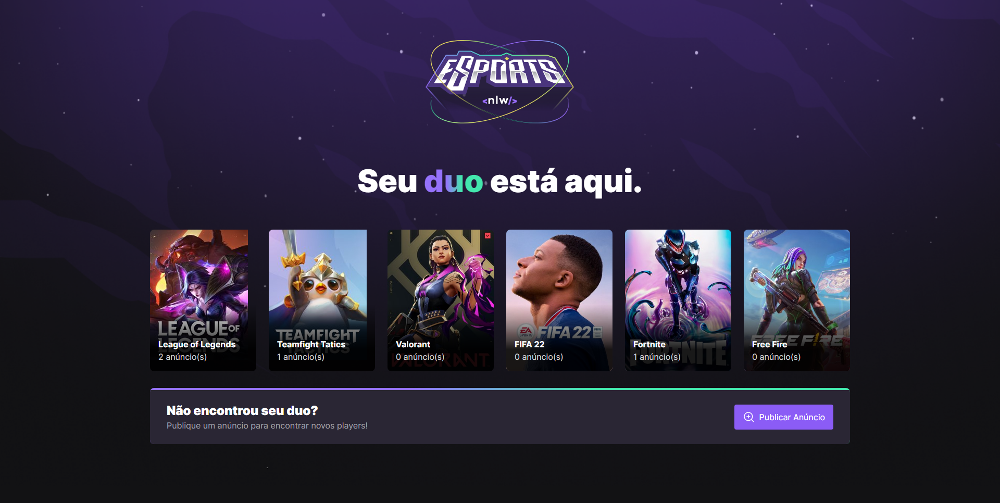
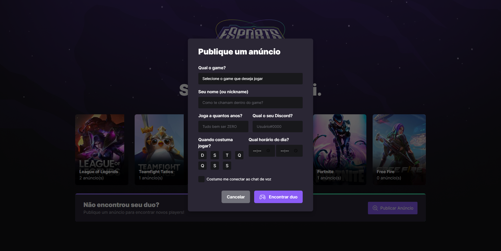

<p align="center">
	
</p>




## Technologies

Technologies that I used to develop this application:

- [React](https://reactjs.org/)
- [Axios](https://github.com/axios/axios)
- [Prisma](https://www.prisma.io/)
- [Express](https://expressjs.com/pt-br/)
- [Radix UI](https://www.radix-ui.com/)
- [Tailwind](https://tailwindcss.com/)
- [TypeScript](https://www.typescriptlang.org/)
- [Phosphor Icons](https://phosphoricons.com/)

## Run Local

Run the following command in both directories to start the application.

```bash
$ npm run start
```
